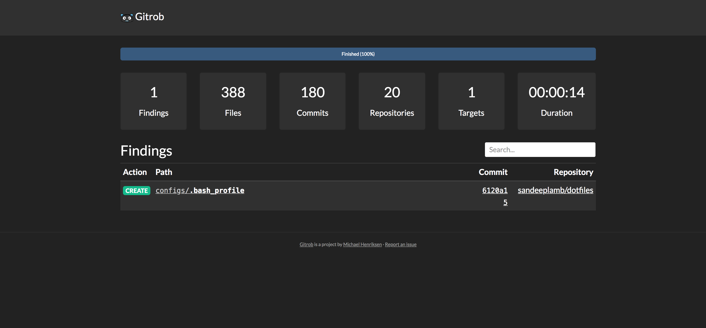

# Tool to Scan github repositories

[gitrob](https://github.com/michenriksen/gitrob) is a tool to help find potentially sensitive files pushed to public repositories on Github.

Easy installation using pre-comiled binaries per environment are present [here](https://github.com/michenriksen/gitrob/releases).

# Usage

Step 1 : Get the token from your github account from 

         Account -> Settings -> Developer Settings -> Personal Access Tokens

Step 2 : Export the below gitrob environment variable.

         `export GITROB_ACCESS_TOKEN=EEEEEEE4787dcc76423dXXXXXXXXXXXXXXXXXX`

Step 3 : Run gitrob with your account name.

         `gitrob sandeeplamb`

# Demo

  <a href="https://asciinema.org/a/dTkwDK5zycp9WXnAznejblG7p?speed=2&amp;autoplay=1">
  </image>
  </a>

# GUI-Interface

[gitrob](https://github.com/michenriksen/gitrob) also gives you a web interface for a better visibility of repositories.

   </image>

